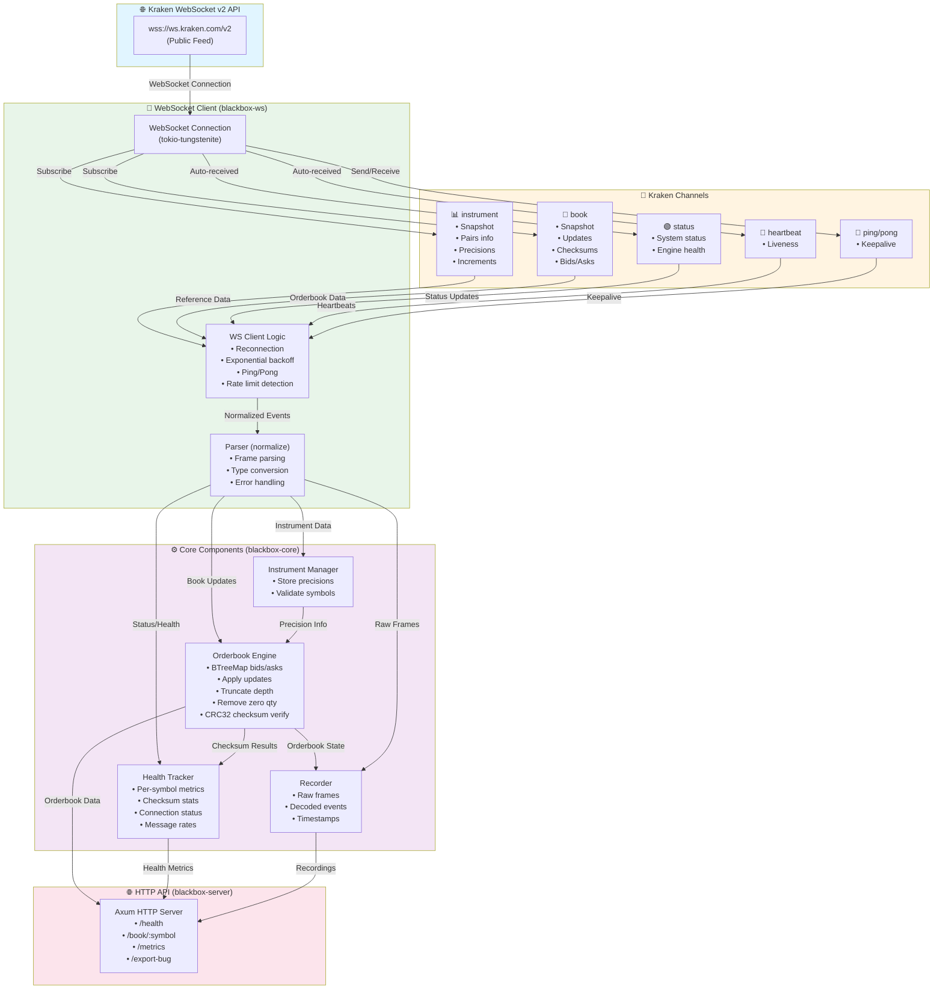

# Kraken Blackbox

A production-quality, high-performance Kraken WebSocket v2 market data client with orderbook engine, checksum verification, recording/replay capabilities, and a local HTTP API.

## Architecture

### System Overview & Data Flow



### Kraken WebSocket v2 Features Used

Blackbox leverages the following **Kraken WebSocket v2 API features**:

#### 1. **WebSocket v2 Public Endpoint** 🌐
```
Endpoint: wss://ws.kraken.com/v2
```
- Public market data feed (no authentication required)
- Used for: Real-time market data ingestion

#### 2. **`instrument` Channel** 📊
```
Subscribe: {"method": "subscribe", "params": {"channel": "instrument", "snapshot": true}}
```
- **Purpose:** Fetch reference data for all trading pairs
- **Data received:**
  - Symbol names (e.g., "BTC/USD")
  - Price precision (decimal places)
  - Quantity precision
  - Price increment (tick size)
  - Quantity increment
  - Trading status
- **Used by:** Precision manager to format prices/quantities correctly for checksums
- **Why critical:** Checksum calculation requires exact precision formatting

#### 3. **`book` Channel (Level 2 Orderbook)** 📖
```
Subscribe: {"method": "subscribe", "params": {"channel": "book", "symbol": ["BTC/USD"], "depth": 10, "snapshot": true}}
```
- **Purpose:** Real-time orderbook updates
- **Data received:**
  - Initial snapshot (full orderbook state)
  - Incremental updates (price level changes)
  - CRC32 checksums (top 10 bids + top 10 asks)
  - Timestamps
- **Used by:** Orderbook engine to maintain local state
- **Why critical:** This is the core data feed for trading systems

#### 4. **Book Checksum Verification** ✅
```
Kraken sends: {"checksum": 2844813076}
Blackbox calculates: CRC32 of formatted top 10 bids + top 10 asks
```
- **Purpose:** Verify orderbook integrity
- **Algorithm:** 
  1. Format prices/quantities per instrument precision
  2. Concatenate: bid1_price + bid1_qty + ... + ask1_price + ask1_qty + ...
  3. Calculate CRC32
  4. Compare with Kraken's checksum
- **Used by:** Orderbook engine to detect corruption
- **Why critical:** Catches missed updates, wrong ordering, precision bugs

#### 5. **`status` Channel** 🟢
```
Auto-received: {"channel": "status", "type": "update", "data": [{"system": "online", ...}]}
```
- **Purpose:** Exchange system status
- **Data received:**
  - System status (online/maintenance)
  - API version
  - Connection ID
- **Used by:** Health tracker to show exchange connectivity
- **Why critical:** Know if exchange is operational

#### 6. **`heartbeat` Channel** 💓
```
Auto-received: {"channel": "heartbeat", "data": {"timestamp": "..."}}
```
- **Purpose:** Connection liveness indicator
- **Frequency:** Automatic (sent by Kraken when subscribed)
- **Used by:** Health tracker to detect connection health
- **Why critical:** Detects stuck connections

#### 7. **`ping` Request** 📡
```
Send: {"method": "ping"}
Receive: {"method": "pong", "time_in": "...", "time_out": "..."}
```
- **Purpose:** Application-level keepalive
- **Frequency:** Every 30 seconds (configurable)
- **Used by:** WS client to maintain connection
- **Why critical:** Prevents idle disconnects (Kraken disconnects after ~1 min of inactivity)

#### 8. **Rate Limit Handling** ⚠️
```
Error received: {"error": "Exceeded msg rate"}
```
- **Purpose:** Detect when sending too many messages
- **Response:** Enter cooldown mode, back off
- **Used by:** WS client to avoid being rate-limited
- **Why critical:** Prevents connection termination

#### 9. **Reconnection Safety** 🔄
- **Exponential backoff:** 1s → 2s → 4s → ... → max 5min
- **Jitter:** Random variation to prevent thundering herd
- **Cloudflare limits:** Respects reconnection rate limits
- **Used by:** WS client for robust connection management
- **Why critical:** Handles network issues gracefully

### Data Flow Example

```
1. Connect to wss://ws.kraken.com/v2
   │
   ├─► Subscribe to "instrument" channel (snapshot=true)
   │   └─► Receive: All trading pairs with precisions
   │       └─► Store in InstrumentManager
   │
   ├─► Subscribe to "book" channel (symbol=["BTC/USD"], depth=10, snapshot=true)
   │   │
   │   ├─► Receive: Initial snapshot
   │   │   └─► Parse bids/asks
   │   │   └─► Build orderbook (BTreeMap)
   │   │   └─► Verify checksum
   │   │
   │   └─► Receive: Incremental updates
   │       └─► Apply to orderbook
   │       └─► Remove zero-quantity levels
   │       └─► Truncate to depth=10
   │       └─► Verify checksum
   │       └─► Update health metrics
   │
   ├─► Receive: Status updates (auto)
   │   └─► Update health tracker
   │
   ├─► Receive: Heartbeats (auto)
   │   └─► Update last activity time
   │
   └─► Send: Ping every 30s
       └─► Receive: Pong
           └─► Update connection health
```

### What Blackbox Does NOT Use (MVP Scope)

- ❌ **Private/Auth WebSocket endpoints** (account data, trading)
- ❌ **REST API endpoints** (historical candles, etc.)
- ❌ **Order placement/cancellation** (trading functionality)

These are out of scope for the MVP but could be added later.

## What is Kraken Blackbox?

Kraken Blackbox is a comprehensive infrastructure tool for ingesting, validating, and debugging Kraken's WebSocket v2 market data feed. It provides:

- **Real-time orderbook management** with automatic depth truncation
- **CRC32 checksum verification** exactly per Kraken's v2 specification
- **Deterministic recording and replay** for debugging orderbook issues
- **Health monitoring** with per-symbol metrics and checksum mismatch detection
- **Bug bundle export** for capturing and sharing orderbook anomalies
- **Precision-preserving decimal handling** (no floating-point errors)

### Why It Matters

When building trading systems, orderbook integrity is critical. Kraken Blackbox helps you:

1. **Detect checksum mismatches** that indicate data corruption or bugs
2. **Reproduce issues deterministically** by replaying recorded sessions
3. **Debug orderbook state** with exportable bug bundles containing frames, config, and health data
4. **Monitor system health** in real-time via HTTP API and web UI

## Quickstart

### Prerequisites

- Rust 1.70+ (install via [rustup](https://rustup.rs/))
- Network access to `wss://ws.kraken.com/v2`

### Build

```bash
cargo build --release
```

### Quick Test (Recommended First Step)

```bash
# Run the automated test script
./test.sh
```

This will:
1. Start the server with BTC/USD
2. Test all endpoints
3. Verify data is flowing
4. Check for errors

See [TESTING.md](TESTING.md) for detailed testing instructions.

### Run

```bash
# Connect to Kraken WS v2, subscribe to BTC/USD and ETH/USD with depth 100
./target/release/blackbox run \
  --symbols BTC/USD,ETH/USD \
  --depth 100 \
  --http 127.0.0.1:8080 \
  --ping-interval 30s \
  --record ./recordings/run1.ndjson
```

### Access the Web UI

Open http://127.0.0.1:8080 in your browser to see:
- Real-time health status for each symbol
- Top-of-book prices (bid/ask/spread/mid)
- Checksum success rate
- Recent checksum mismatches

### Replay a Recording

```bash
# Replay at 4x speed
./target/release/blackbox replay \
  --input ./recordings/run1.ndjson \
  --speed 4.0 \
  --http 127.0.0.1:8080
```

### Workspace Structure

```
kraken-blackbox/
├── Cargo.toml              # Workspace manifest
├── crates/
│   ├── blackbox-core/      # Core types, orderbook, checksum, precision
│   ├── blackbox-ws/         # WebSocket client, parser, subscriptions
│   └── blackbox-server/     # HTTP server, CLI, main application
└── README.md
```

## API Reference

### HTTP Endpoints

#### `GET /health`

Returns overall health status and per-symbol metrics.

**Response:**
```json
{
  "status": "OK",
  "uptime_seconds": 3600,
  "symbols": [
    {
      "symbol": "BTC/USD",
      "connected": true,
      "last_msg_ts": "2024-01-15T10:30:00Z",
      "total_msgs": 125000,
      "checksum_ok": 124995,
      "checksum_fail": 5,
      "checksum_ok_rate": 0.99996,
      "last_checksum_mismatch": "2024-01-15T10:25:00Z",
      "consecutive_fails": 0,
      "reconnect_count": 2,
      "msg_rate_estimate": 34.7,
      "health_score": 98,
      "status": "OK"
    }
  ]
}
```

#### `GET /book/:symbol/top`

Returns top-of-book (best bid/ask, spread, mid).

**Example:**
```bash
curl http://127.0.0.1:8080/book/BTC%2FUSD/top
```

**Response:**
```json
{
  "symbol": "BTC/USD",
  "best_bid": ["50000.12", "1.5"],
  "best_ask": ["50001.45", "2.3"],
  "spread": "1.33",
  "mid": "50000.785"
}
```

#### `GET /book/:symbol?limit=25`

Returns full orderbook (or limited depth).

**Query Parameters:**
- `limit` (optional): Maximum number of levels per side (default: all)

**Example:**
```bash
curl "http://127.0.0.1:8080/book/BTC%2FUSD?limit=10"
```

**Response:**
```json
{
  "symbol": "BTC/USD",
  "bids": [
    ["50000.12", "1.5"],
    ["50000.11", "2.0"],
    ...
  ],
  "asks": [
    ["50001.45", "2.3"],
    ["50001.46", "1.8"],
    ...
  ]
}
```

#### `GET /metrics`

Returns Prometheus-formatted metrics.

**Example:**
```bash
curl http://127.0.0.1:8080/metrics
```

#### `POST /export-bug`

Exports a "bug bundle" ZIP containing:
- `config.json`: Current configuration
- `health.json`: Health state at export time
- `frames.ndjson`: Last 60 seconds of raw WebSocket frames
- `instruments.json`: Latest instrument snapshot

**Response:**
```json
{
  "path": "./bug_bundles/incident_1705312200.zip",
  "incident_id": "incident_1705312200"
}
```

## Checksum Verification

Kraken Blackbox implements CRC32 checksum verification exactly as specified in the [Kraken v2 checksum guide](https://docs.kraken.com/api/docs/guides/spot-ws-book-v2/).

### Algorithm

1. **Format levels**: For each of the top 10 asks (low→high) and top 10 bids (high→low):
   - Format price to exactly `price_precision` decimal places
   - Format qty to exactly `qty_precision` decimal places
   - Remove the decimal point
   - Remove leading zeros (but keep at least "0")
   - Concatenate: `price_str + qty_str`

2. **Build string**: Concatenate all ask levels, then all bid levels

3. **Compute CRC32**: Run CRC32 on the concatenated string

4. **Compare**: Verify against the `checksum` field in the message

### Why Decimals Matter

Using `f64` for prices/quantities can introduce floating-point errors that break checksum verification. Kraken Blackbox uses `rust_decimal::Decimal` to preserve exact precision throughout the pipeline.

### Example

```rust
// Price: 50000.12, Qty: 1.5, Precision: 2
// Formatted: "5000012" + "15" = "500001215"
// This exact string is used in CRC32 computation
```

## Configuration

### Command-Line Options

#### `run` command

- `--symbols`: Comma-separated list of symbols (e.g., `BTC/USD,ETH/USD`)
- `--depth`: Orderbook depth (10, 25, 100, 500, 1000)
- `--http`: HTTP server address (default: `127.0.0.1:8080`)
- `--ping-interval`: Application-level ping interval (default: `30s`)
- `--record`: Optional path to recording file (NDJSON format)

#### `replay` command

- `--input`: Path to recording file
- `--speed`: Replay speed multiplier (1.0 = realtime, 4.0 = 4x, 0 = as-fast)
- `--http`: HTTP server address

## Testing

### Unit Tests

```bash
# Run all tests
cargo test

# Run checksum tests specifically
cargo test --package blackbox-core checksum

# Run orderbook tests
cargo test --package blackbox-core orderbook
```

### Integration Test

1. Start the client:
   ```bash
   cargo run --release -- run --symbols BTC/USD --depth 10 --http 127.0.0.1:8080
   ```

2. Wait 60 seconds and check:
   - Health endpoint shows `connected: true`
   - Checksum success rate > 99%
   - No excessive reconnects

## Performance Notes

- **Zero-copy parsing**: Frames are parsed in-place where possible
- **Lock-free reads**: Uses `DashMap` for concurrent orderbook access
- **Efficient truncation**: BTreeMap allows O(log n) truncation
- **Ring buffer**: Last 1000 frames kept in memory for bug bundle export

## Troubleshooting

### "Exceeded msg rate" Error

Kraken rate-limits subscription requests. If you see this error:
- The client automatically enters cooldown mode
- Reconnects after 60 seconds
- Reduce subscription frequency if persistent

### Checksum Mismatches

If checksum mismatches occur:
1. Check `/health` endpoint for details
2. Use `POST /export-bug` to capture the incident
3. Replay the recording to reproduce
4. Verify precision settings match instrument data

### Connection Drops

The client implements:
- Exponential backoff with jitter (max 5 minutes)
- Application-level ping every 30s (configurable)
- Automatic reconnection
- Idle timeout detection

## License

MIT OR Apache-2.0

## Contributing

This is a hackathon project, but contributions are welcome! Key areas:
- Additional test coverage
- Performance optimizations
- Enhanced replay functionality
- More detailed metrics

## References

- [Kraken WebSocket v2 Book Documentation](https://docs.kraken.com/api/docs/websocket-v2/book)
- [Kraken Checksum Guide (v2)](https://docs.kraken.com/api/docs/guides/spot-ws-book-v2/)
- [Kraken WebSocket FAQ](https://support.kraken.com/articles/360022326871-kraken-websocket-api-frequently-asked-questions)

