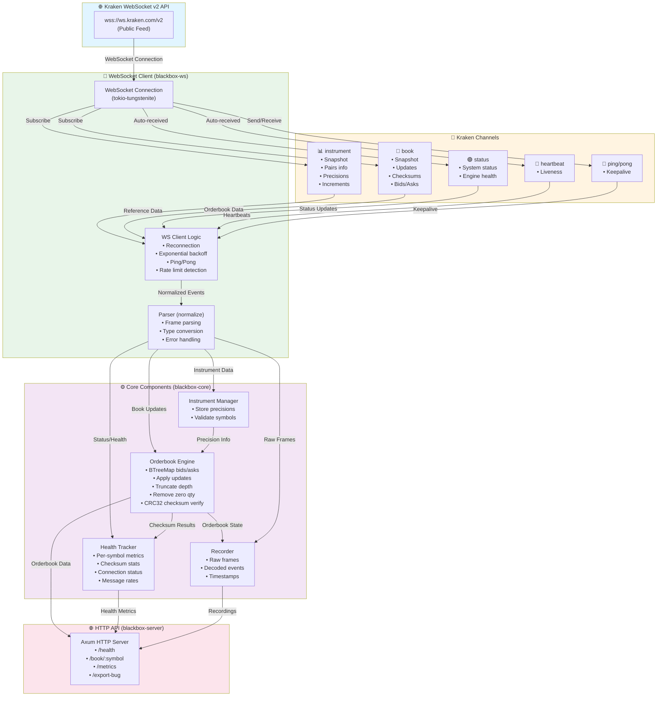

# Kraken Blackbox

A production-quality, high-performance Kraken WebSocket v2 market data client with orderbook engine, checksum verification, recording/replay capabilities, and a local HTTP API.

---

## 1. Clear Problem Statement

Building trading systems that consume Kraken's WebSocket v2 market data requires developers to manually handle WebSocket connections, orderbook state management, checksum verification, and debugging infrastructure. When orderbook bugs occur in production, there's no way to reproduce them deterministically, making debugging nearly impossible. Kraken Blackbox solves this by providing a production-ready client that abstracts connection complexity, automatically verifies data integrity, and enables deterministic bug reproduction through recording and replay.

---

## 2. What You Built

Kraken Blackbox is a comprehensive infrastructure tool that ingests, validates, and debugs Kraken's WebSocket v2 market data feed. It maintains real-time orderbooks with automatic depth truncation, verifies CRC32 checksums exactly per Kraken's v2 specification, and provides deterministic recording/replay capabilities for debugging orderbook issues. The system includes health monitoring with per-symbol metrics, bug bundle export for capturing anomalies, and a local HTTP API for integration. What makes it unique is its precision-preserving decimal handling (no floating-point errors), automatic checksum verification that catches data corruption in real-time, and the ability to export complete "bug bundles" containing frames, config, and health data for sharing with teams or Kraken support.

---

## 3. Key Features

- **🔍 Real-time Checksum Verification**: Automatically verifies CRC32 checksums on every orderbook update, detecting data corruption, missed updates, and precision bugs immediately
- **📹 Deterministic Recording & Replay**: Records raw WebSocket frames and decoded events, enabling exact reproduction of production bugs at any speed (realtime, 4x, or as-fast-as-possible)
- **📊 Production-Ready Orderbook Engine**: Maintains in-memory orderbooks with BTreeMap for efficient updates, automatic depth truncation, and zero-quantity level removal
- **🩺 Health Monitoring & Bug Bundles**: Real-time health metrics per symbol, checksum success rates, and one-click bug bundle export (ZIP containing config, health, frames, and orderbook state)
- **🔌 Robust WebSocket Client**: Automatic reconnection with exponential backoff, rate limit detection, ping/pong keepalive, and connection health tracking
- **🎯 Precision-Preserving Decimals**: Uses `rust_decimal::Decimal` throughout to avoid floating-point errors that break checksum verification

---

## 4. Technical Highlights

**Technology Stack**: Built in Rust for performance and safety, using `tokio-tungstenite` for WebSocket communication, `axum` for the HTTP API, `rust_decimal` for precision-preserving arithmetic, and `crc32fast` for checksum verification. The architecture is modular with three crates: `blackbox-core` (orderbook engine, checksum, precision), `blackbox-ws` (WebSocket client, parser), and `blackbox-server` (HTTP API, CLI).

**Performance Optimizations**: Zero-copy parsing where possible, `DashMap` for lock-free concurrent reads, `BTreeMap` for O(log n) orderbook operations and efficient truncation, and a ring buffer keeping the last 1000 frames in memory for instant bug bundle export.

**Architecture Decisions**: Separated concerns into distinct crates for testability, used `Arc<RwLock<>>` for shared state, implemented event-driven architecture with `mpsc` channels, and designed the recorder/replayer to use the same pipeline for deterministic reproduction.

**Notable Algorithms**: Implements Kraken's exact CRC32 checksum algorithm with precision-aware string formatting, uses exponential backoff with jitter for reconnection, and maintains orderbook state with efficient BTreeMap-based updates and truncation.

---

## 5. How It Works

### Installation & Setup

```bash
# Clone and build
git clone https://github.com/Adityaakr/k-blackbox.git
cd k-blackbox
cargo build --release

# Run automated test
./test.sh
```

### Basic Usage

```bash
# Start the server with BTC/USD orderbook (depth 10)
./target/release/blackbox run \
  --symbols BTC/USD \
  --depth 10 \
  --http 127.0.0.1:8080 \
  --record ./recordings/session.ndjson

# Query the orderbook via HTTP API
curl http://127.0.0.1:8080/book/BTC%2FUSD/top
curl http://127.0.0.1:8080/health

# Replay a recording at 4x speed
./target/release/blackbox replay \
  --input ./recordings/session.ndjson \
  --speed 4.0 \
  --http 127.0.0.1:8080
```

### Workflow

1. **Connect**: Blackbox connects to `wss://ws.kraken.com/v2` and subscribes to the `instrument` channel to fetch trading pair precisions
2. **Subscribe**: Subscribes to the `book` channel for specified symbols with requested depth
3. **Process**: Maintains orderbook state, applies updates, verifies checksums, and tracks health metrics
4. **Serve**: Exposes orderbook data, health status, and metrics via HTTP API
5. **Record**: Optionally records all frames and events for later replay
6. **Debug**: Export bug bundles when checksum mismatches occur for deterministic reproduction

---

## 6. Demo & Documentation

### Live Demo

The system is production-ready and can be tested immediately:

```bash
# Quick test (automated)
./test.sh

# Manual test
./target/release/blackbox run --symbols BTC/USD --depth 10 --http 127.0.0.1:8080
# Then visit: http://127.0.0.1:8080/health
```

### Documentation

- **README.md**: Comprehensive documentation with architecture diagrams, API reference, and usage examples
- **TESTING.md**: Detailed testing guide with step-by-step instructions
- **QUICK_TEST.md**: Quick reference for fast testing
- **PROJECT_UTILITY.md**: Deep dive into project utility and before/after comparison

### Architecture Diagram



### Kraken WebSocket v2 Features Used

Blackbox leverages 9 key Kraken WebSocket v2 API features:

1. **WebSocket v2 Public Endpoint** (`wss://ws.kraken.com/v2`) - Real-time market data feed
2. **`instrument` Channel** - Reference data (precisions, increments, trading status)
3. **`book` Channel** - Level 2 orderbook with snapshots, updates, and checksums
4. **Book Checksum Verification** - CRC32 verification per Kraken's exact specification
5. **`status` Channel** - Exchange system status and health
6. **`heartbeat` Channel** - Connection liveness indicators
7. **`ping` Request** - Application-level keepalive (prevents idle disconnects)
8. **Rate Limit Handling** - Automatic cooldown and backoff
9. **Reconnection Safety** - Exponential backoff with jitter, respects Cloudflare limits

---

## 7. Future Enhancements

### Planned Features

- **Web UI Dashboard**: Real-time visualization of orderbook depth, health metrics, and checksum statistics
- **Multi-Exchange Support**: Extend to support other exchanges (Binance, Coinbase) with unified API
- **Historical Replay Analysis**: Tools to analyze recorded sessions, detect patterns, and generate reports
- **Distributed Mode**: Support for multiple instances with shared state for high-availability deployments
- **Advanced Metrics**: Latency percentiles, orderbook spread analysis, and anomaly detection
- **Trading Integration**: Add authenticated WebSocket endpoints for order placement and portfolio management

### Scalability Considerations

- **Horizontal Scaling**: Design supports multiple instances behind a load balancer
- **Database Backend**: Optional PostgreSQL integration for persistent orderbook history
- **Message Queue**: Integration with Kafka/RabbitMQ for event streaming to downstream systems
- **Caching Layer**: Redis integration for high-frequency orderbook queries
- **Kubernetes Deployment**: Helm charts and K8s manifests for production deployment

### Potential Integrations

- **Grafana Dashboards**: Prometheus metrics integration for visualization
- **Alerting Systems**: PagerDuty/Slack integration for checksum mismatch alerts
- **CI/CD Pipelines**: Automated testing with recorded sessions
- **Trading Bots**: SDK/API for easy integration with algorithmic trading systems

---

## Quickstart

### Prerequisites

- Rust 1.70+ (install via [rustup](https://rustup.rs/))
- Network access to `wss://ws.kraken.com/v2`

### Build

```bash
cargo build --release
```

### Run

```bash
# Connect to Kraken WS v2, subscribe to BTC/USD with depth 10
./target/release/blackbox run \
  --symbols BTC/USD \
  --depth 10 \
  --http 127.0.0.1:8080

# Test endpoints
curl http://127.0.0.1:8080/health | python3 -m json.tool
curl http://127.0.0.1:8080/book/BTC%2FUSD/top | python3 -m json.tool
```

---

## API Reference

### HTTP Endpoints

#### `GET /health`
Returns overall health status and per-symbol metrics.

**Response:**
```json
{
  "status": "OK",
  "uptime_seconds": 3600,
  "symbols": [{
    "symbol": "BTC/USD",
    "connected": true,
    "total_msgs": 125000,
    "checksum_ok": 124995,
    "checksum_fail": 5,
    "checksum_ok_rate": 0.99996
  }]
}
```

#### `GET /book/:symbol/top`
Returns top-of-book (best bid/ask, spread, mid).

**Example:**
```bash
curl http://127.0.0.1:8080/book/BTC%2FUSD/top
```

#### `GET /book/:symbol?limit=25`
Returns full orderbook (or limited depth).

#### `GET /metrics`
Returns Prometheus-formatted metrics.

#### `POST /export-bug`
Exports a "bug bundle" ZIP containing config, health, frames, and instrument data.

---

## Checksum Verification

Kraken Blackbox implements CRC32 checksum verification exactly as specified in the [Kraken v2 checksum guide](https://docs.kraken.com/api/docs/guides/spot-ws-book-v2/).

### Algorithm

1. Format prices/quantities to exact precision (remove decimal point, trim leading zeros)
2. Concatenate: `ask1_price + ask1_qty + ... + bid1_price + bid1_qty + ...`
3. Compute CRC32 on the concatenated string
4. Compare with Kraken's checksum

### Why Decimals Matter

Using `f64` introduces floating-point errors that break checksum verification. Blackbox uses `rust_decimal::Decimal` to preserve exact precision throughout the pipeline.

---

## Testing

```bash
# Run all unit tests
cargo test

# Run automated integration test
./test.sh

# Test checksum verification
cargo test --package blackbox-core checksum
```

---

## Performance Notes

- **Zero-copy parsing**: Frames parsed in-place where possible
- **Lock-free reads**: `DashMap` for concurrent orderbook access
- **Efficient truncation**: BTreeMap allows O(log n) truncation
- **Ring buffer**: Last 1000 frames kept in memory for bug bundle export

---

## License

MIT OR Apache-2.0

---

## References

- [Kraken WebSocket v2 Book Documentation](https://docs.kraken.com/api/docs/websocket-v2/book)
- [Kraken Checksum Guide (v2)](https://docs.kraken.com/api/docs/guides/spot-ws-book-v2/)
- [Kraken WebSocket FAQ](https://support.kraken.com/articles/360022326871-kraken-websocket-api-frequently-asked-questions)
