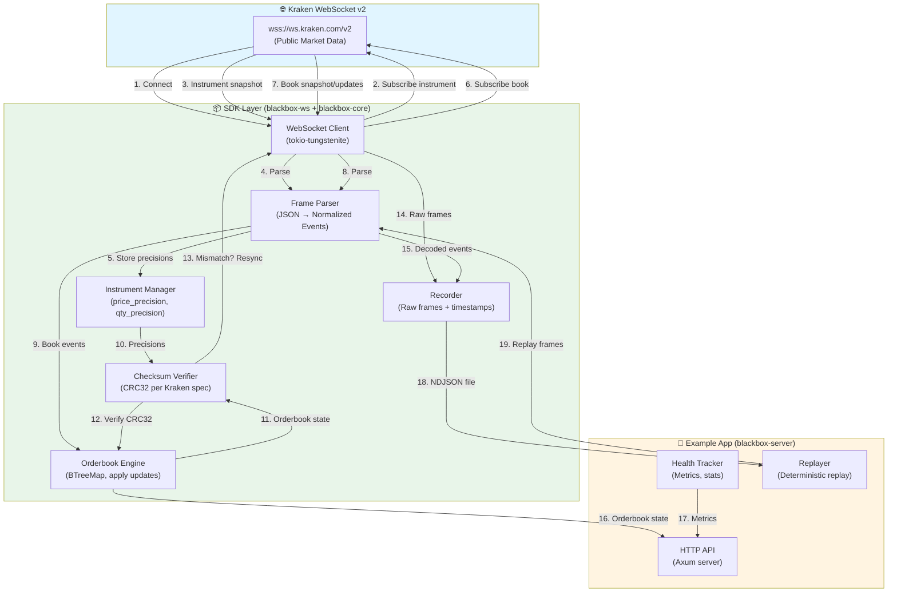

# Kraken Blackbox: Verified Orderbooks + Record/Replay Debugging

**A Rust SDK for Kraken WebSocket v2 that verifies L2 orderbook integrity via CRC32 checksums and enables deterministic bug reproduction through frame-level recording and replay.**

[](https://www.rust-lang.org/)
[](https://opensource.org/licenses/MIT)
[](https://github.com/Adityaakr/k-blackbox)

---

## A) Clear Problem Statement

Building reliable trading systems on Kraken WebSocket v2 requires manual WebSocket handling, orderbook state management, and checksum verification. When orderbook bugs occur in production—checksum mismatches, missed updates, or precision errors—there's no way to reproduce them deterministically. Teams spend hours debugging with incomplete logs and no visibility into the exact sequence of WebSocket frames that caused the issue.

---

## B) What You Built

Kraken Blackbox is a production-minded Rust SDK (`blackbox-core` + `blackbox-ws`) that abstracts Kraken WebSocket v2 complexity and provides verified L2 orderbooks with automatic checksum validation. The SDK maintains in-memory orderbooks, verifies CRC32 checksums per Kraken's v2 specification, and records raw WebSocket frames for deterministic replay. A companion CLI tool (`blackbox-server`) demonstrates SDK usage with a local HTTP API for health monitoring and bug bundle export.

**What makes it unique**: Precision-preserving decimal handling (no floating-point errors), automatic checksum verification with auto-resync on mismatch, and deterministic record/replay that re-feeds frames through the same pipeline for exact bug reproduction.

---

## Architecture & Data Flow



### Flow Overview

1. **Connection**: SDK connects to Kraken WebSocket v2 public endpoint
2. **Instrument Channel**: Subscribes to get symbol precisions (`price_precision`, `qty_precision`)
3. **Book Channel**: Subscribes to L2 orderbook with specified depth
4. **Processing**: Frames parsed → orderbook updated → checksum verified
5. **Recording**: Raw frames + decoded events written to NDJSON
6. **Serving**: HTTP API exposes orderbooks, health, and bug bundles
7. **Replay**: Recorded frames re-fed through same pipeline deterministically

---

## C) Key Features

- **Checksum-verified orderbooks**: Validates CRC32 on every update per Kraken WS v2 spec, auto-resyncs on mismatch
- **Deterministic record/replay**: Records raw WS frames + timestamps, replays through same pipeline at any speed
- **Precision-preserving decimals**: Uses `rust_decimal::Decimal` throughout (no f64) to preserve exact precision
- **Production-minded reliability**: Auto-reconnection with exponential backoff, rate limit detection, ping/pong keepalive
- **Health monitoring**: Per-symbol checksum stats, message rates, connection status, last seen times
- **Bug bundle export**: One-click ZIP export (config, health, frames, orderbook state) for incident sharing

---

## D) Technical Highlights

Built in Rust with `tokio` for async I/O and `tokio-tungstenite` for WebSocket communication. Orderbooks use `BTreeMap<Decimal, Decimal>` for efficient ordered iteration and O(log n) truncation. Checksum verification implements Kraken's exact CRC32 algorithm: formats price/qty as fixed decimals using `price_precision`/`qty_precision` from instrument channel, concatenates asks then bids, computes CRC32. All arithmetic uses `rust_decimal::Decimal` to avoid floating-point precision errors. WebSocket client handles reconnection with exponential backoff + jitter, detects "Exceeded msg rate" errors and enters cooldown mode, sends application-level ping messages every 30s to prevent idle disconnects. Recorder writes NDJSON with raw frames + timestamps; replayer re-feeds frames through the same parsing/orderbook/checksum pipeline for deterministic reproduction.

---

## E) How It Works

### Install & Build

```bash
git clone https://github.com/Adityaakr/k-blackbox.git
cd k-blackbox
cargo build --release
```

### Quickstart

```bash
# Start the server
./target/release/blackbox run --symbols BTC/USD --depth 10

# Check health
curl http://127.0.0.1:8080/health

# Get top of book
curl http://127.0.0.1:8080/book/BTC%2FUSD/top
```

### SDK Usage

```rust
use blackbox_ws::{WsClient, WsEvent};
use blackbox_core::{Orderbook, verify_checksum};
use tokio::sync::mpsc;
use std::time::Duration;

#[tokio::main]
async fn main() -> anyhow::Result<()> {
    let (tx, mut rx) = mpsc::unbounded_channel();
    let client = WsClient::new(
        vec!["BTC/USD".to_string()],
        10, // depth
        Duration::from_secs(30),
        tx,
    );

    tokio::spawn(async move { client.run().await.unwrap() });

    let mut orderbooks = std::collections::HashMap::new();
    let mut instruments = std::collections::HashMap::new();

    while let Some(event) = rx.recv().await {
        match event {
            WsEvent::InstrumentSnapshot(inst_map) => {
                instruments = inst_map;
            }
            WsEvent::BookSnapshot { symbol, bids, asks, checksum } => {
                let mut ob = Orderbook::new();
                ob.apply_snapshot(bids, asks);
                orderbooks.insert(symbol.clone(), ob);
                
                if let Some(expected) = checksum {
                    let inst = instruments.get(&symbol).unwrap();
                    let is_valid = verify_checksum(
                        &orderbooks[&symbol],
                        expected,
                        inst.price_precision,
                        inst.qty_precision,
                    );
                    if !is_valid {
                        eprintln!("Checksum mismatch for {}", symbol);
                    }
                }
            }
            WsEvent::BookUpdate { symbol, bids, asks, checksum, .. } => {
                let ob = orderbooks.get_mut(&symbol).unwrap();
                ob.apply_updates(bids, asks);
                
                if let Some(expected) = checksum {
                    let inst = instruments.get(&symbol).unwrap();
                    let is_valid = verify_checksum(
                        ob,
                        expected,
                        inst.price_precision,
                        inst.qty_precision,
                    );
                    if !is_valid {
                        eprintln!("Checksum mismatch for {}", symbol);
                    }
                }
            }
            _ => {}
        }
    }
    Ok(())
}
```

### Workflow Steps

1. **Connect**: SDK connects to `wss://ws.kraken.com/v2` (Kraken WebSocket v2 public endpoint)
2. **Instrument**: Subscribes to `instrument` channel (snapshot=true) to fetch `price_precision`/`qty_precision` for symbols
3. **Book**: Subscribes to `book` channel (L2) with specified depth, receives snapshot + updates
4. **Verify**: On each book update, computes CRC32 checksum using instrument precisions, compares with Kraken's checksum
5. **Resync**: On mismatch, auto-resubscribes to book snapshot for that symbol
6. **Record**: Recorder writes raw WS frames + timestamps to NDJSON file
7. **Serve**: HTTP API exposes health, orderbook queries, bug bundle export

---

## F) Demo & Documentation

**GitHub Repository**: [https://github.com/Adityaakr/k-blackbox](https://github.com/Adityaakr/k-blackbox)

**Video Walkthrough**: *(add video link here)*

**Screenshot**: *(add gif here showing health endpoint + orderbook query)*

### API Examples

**Health endpoint:**
```bash
curl http://127.0.0.1:8080/health
```
```json
{
  "status": "OK",
  "symbols": [{
    "symbol": "BTC/USD",
    "connected": true,
    "total_msgs": 125000,
    "checksum_ok": 124995,
    "checksum_fail": 5
  }]
}
```

**Top of book:**
```bash
curl http://127.0.0.1:8080/book/BTC%2FUSD/top
```
```json
{
  "symbol": "BTC/USD",
  "best_bid": ["89913.3", "0.00366279"],
  "best_ask": ["89913.4", "3.56256894"],
  "spread": "0.1"
}
```

**Bug bundle export:**
```bash
curl -X POST http://127.0.0.1:8080/export-bug \
  -H "Content-Type: application/json" \
  -d '{"symbol": "BTC/USD"}' \
  -o bug-bundle.zip
```

**Documentation**: See `/docs` directory:
- `API.md` - HTTP API reference
- `TESTING.md` - Testing guide
- `QUICK_TEST.md` - Quick test commands

---

## G) Future Enhancements

- Multi-connection sharding router for high-throughput symbol subscriptions
- Strategy hooks: callback API for custom orderbook event handlers
- Richer UI dashboard: real-time visualization of orderbook depth and health metrics
- Integration with Grafana: Prometheus metrics export for monitoring dashboards

---

## CLI Usage

**Run live connection:**
```bash
./target/release/blackbox run \
  --symbols BTC/USD,ETH/USD \
  --depth 25 \
  --http 127.0.0.1:8080 \
  --record ./session.ndjson
```

**Replay recording:**
```bash
./target/release/blackbox replay \
  --input ./session.ndjson \
  --speed 4.0 \
  --http 127.0.0.1:8080
```

---

## HTTP API

- `GET /health` - Overall health + per-symbol checksum stats, message rates, connection status
- `GET /book/:symbol/top` - Top of book (best bid/ask, spread, mid price)
- `GET /book/:symbol?limit=N` - Full orderbook (or limited depth)
- `GET /metrics` - Prometheus-formatted metrics
- `POST /export-bug` - Export bug bundle ZIP (config, health, frames, instruments)

See `/docs/API.md` for detailed request/response examples.

---

## Testing

```bash
# Unit tests
cargo test

# Integration test
./test.sh

# Test checksum verification
cargo test --package blackbox-core checksum
```

---

## Repo Layout

```
kraken-blackbox/
├── crates/
│   ├── blackbox-core/     # SDK: orderbook, checksum, precision, types
│   ├── blackbox-ws/        # SDK: WebSocket client, parser
│   └── blackbox-server/    # Example app: CLI + HTTP API
├── docs/
│   ├── API.md
│   ├── TESTING.md
│   └── QUICK_TEST.md
├── Cargo.toml
└── README.md
```

---

## References

- [Kraken WebSocket v2 Book Documentation](https://docs.kraken.com/api/docs/websocket-v2/book)
- [Kraken Checksum Guide (v2)](https://docs.kraken.com/api/docs/guides/spot-ws-book-v2/)
- [Kraken WebSocket FAQ](https://support.kraken.com/articles/360022326871-kraken-websocket-api-frequently-asked-questions)

---

## License

MIT License - see [LICENSE](LICENSE) file for details.
